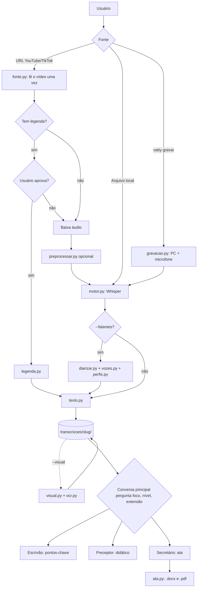

# Fluxo da Vatty

```mermaid
flowchart TD
    U[Usuário] --> V{Fonte}
    V -->|URL YouTube/TikTok| Y[fonte.py: lê o vídeo uma vez]
    V -->|Arquivo local| M
    V -->|vatty gravar| G[gravacao.py: PC + microfone]
    G --> M
    Y --> L{Tem legenda?}
    L -->|sim| Q{Usuário aprova?}
    Q -->|sim| LG[legenda.py]
    Q -->|não| A[Baixa áudio]
    L -->|não| A
    A --> P[preprocessar.py opcional]
    P --> M[motor.py: Whisper]
    LG --> T
    M --> D{--falantes?}
    D -->|sim| F[diarizar.py + vozes.py + perfis.py]
    D -->|não| T
    F --> T[texto.py]
    T --> PASTA[(transcricoes/slug/)]
    PASTA -.->|--visual| VIS[visual.py + ocr.py]
    VIS --> PASTA

    PASTA --> VT{Conversa principal pergunta foco, nível, extensão}
    VT --> E[Escrivão: pontos-chave]
    VT --> PR[Preceptor: didático]
    VT --> S[Secretário: ata]
    S --> ATA[ata.py: .docx e .pdf]
```

Linha contínua é código determinístico. Os três agentes são os únicos pontos com LLM e só
rodam sob demanda, nunca em cadeia.
